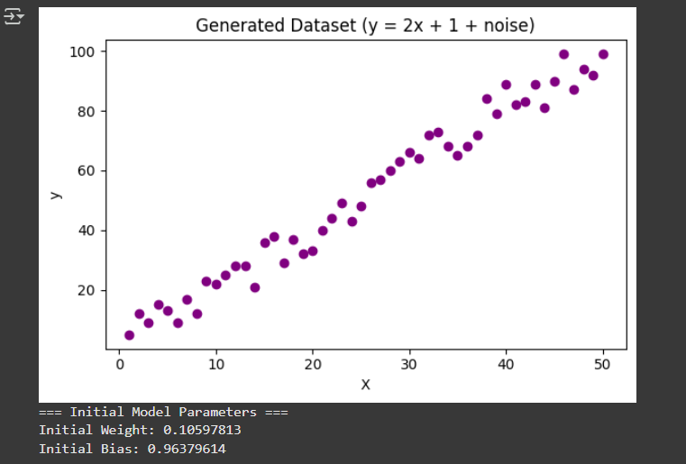
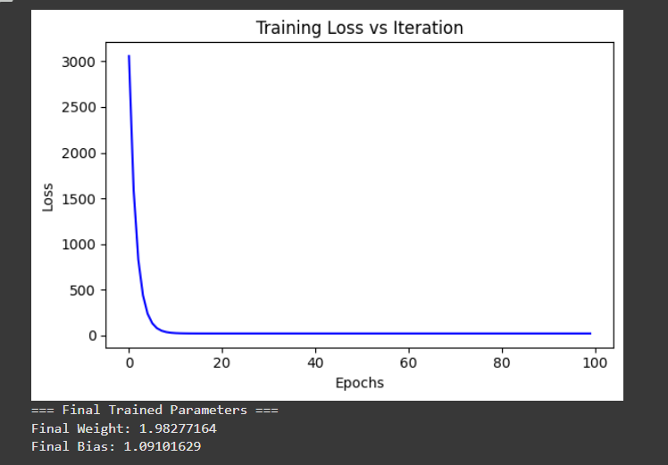
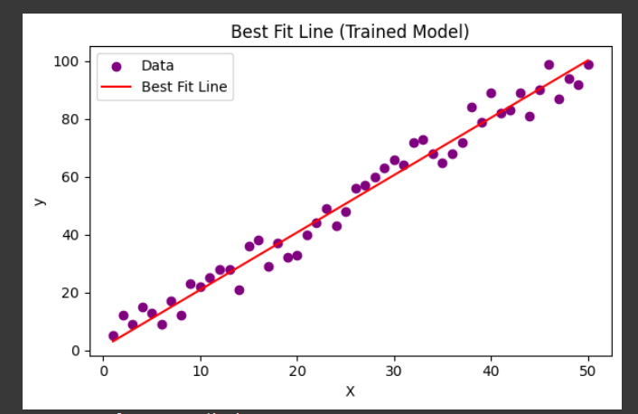
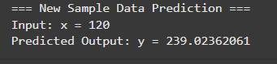

# Developing a Neural Network Regression Model

## AIM
To develop a neural network regression model for the given dataset.

## THEORY
Regression problems involve predicting a continuous output variable based on input features. Traditional linear regression models often struggle with complex patterns in data. Neural networks, specifically feedforward neural networks, can capture these complex relationships by using multiple layers of neurons and activation functions. In this experiment, a neural network model is introduced with a single linear layer that learns the parameters weight and bias using gradient descent.

## Neural Network Model


## DESIGN STEPS
### STEP 1: Generate Dataset

Create input values  from 1 to 50 and add random noise to introduce variations in output values .

### STEP 2: Initialize the Neural Network Model

Define a simple linear regression model using torch.nn.Linear() and initialize weights and bias values randomly.

### STEP 3: Define Loss Function and Optimizer

Use Mean Squared Error (MSE) as the loss function and optimize using Stochastic Gradient Descent (SGD) with a learning rate of 0.001.

### STEP 4: Train the Model

Run the training process for 100 epochs, compute loss, update weights and bias using backpropagation.

### STEP 5: Plot the Loss Curve

Track the loss function values across epochs to visualize convergence.

### STEP 6: Visualize the Best-Fit Line

Plot the original dataset along with the learned linear model.

### STEP 7: Make Predictions

Use the trained model to predict  for a new input value .

## PROGRAM

### Name: PRIYAADARSHINI K

### Register Number: 212223240126

```python
# Importing libraries

import torch as t
import torch.nn as nn
import matplotlib.pyplot as plt

# DATA GENERATION
t.manual_seed(71)
X = t.linspace(1, 50, 50).reshape(-1, 1)
noise = t.randint(-8, 9, (50, 1), dtype=t.float)
y = 2 * X + 1 + noise

# Dataset information
plt.figure(figsize=(6, 4))
plt.scatter(X.numpy(), y.numpy(), color='purple')
plt.xlabel('X')
plt.ylabel('y')
plt.title('Generated Dataset (y = 2x + 1 + noise)')
plt.tight_layout()
plt.show()

# Model definition

class Model(nn.Module):
    def __init__(self):
        super().__init__()
        self.linear = nn.Linear(1, 1)

    def forward(self, x):
        return self.linear(x)

# Initialize model
t.manual_seed(59)
model = Model()

# Print initial weight and bias
print("=== Initial Model Parameters ===")
print(f"Initial Weight: {model.linear.weight.item():.8f}")
print(f"Initial Bias: {model.linear.bias.item():.8f}\n")


# Loss function and optimizer

loss_fn = nn.MSELoss()
optimizer = t.optim.SGD(model.parameters(), lr=0.001)

# Training loop

losses = []

for epoch in range(100):
    optimizer.zero_grad()
    y_pred = model(X)
    loss = loss_fn(y_pred, y)
    loss.backward()
    optimizer.step()
    losses.append(loss.item())

# Training loss vs iteration plot

plt.figure(figsize=(6, 4))
plt.plot(range(100), losses, color='blue')
plt.xlabel('Epochs')
plt.ylabel('Loss')
plt.title('Training Loss vs Iteration')
plt.tight_layout()
plt.show()

# Final parameters

final_weight = model.linear.weight.item()
final_bias = model.linear.bias.item()
print("=== Final Trained Parameters ===")
print(f"Final Weight: {final_weight:.8f}")
print(f"Final Bias: {final_bias:.8f}\n")

# Best fit line plot

x_line = t.tensor([[X.min().item()], [X.max().item()]])
y_line = model(x_line).detach()

plt.figure(figsize=(6, 4))
plt.scatter(X.numpy(), y.numpy(), label='Data', color='purple')
plt.plot(x_line.numpy(), y_line.numpy(), color='red', label='Best Fit Line')
plt.xlabel('X')
plt.ylabel('y')
plt.title('Best Fit Line (Trained Model)')
plt.legend()
plt.tight_layout() 
plt.show()

# New sample data prediction

x_test = t.tensor([[120.0]])
y_test_pred = model(x_test).item()
print("=== New Sample Data Prediction ===")
print(f"Input: x = 120")
print(f"Predicted Output: y = {y_test_pred:.8f}")


# Initialize the Model, Loss Function, and Optimizer

```

### Dataset Information


### OUTPUT
Training Loss Vs Iteration Plot



Best Fit line plot



### New Sample Data Prediction


## RESULT
Thus, a neural network regression model was successfully developed and trained using PyTorch.
